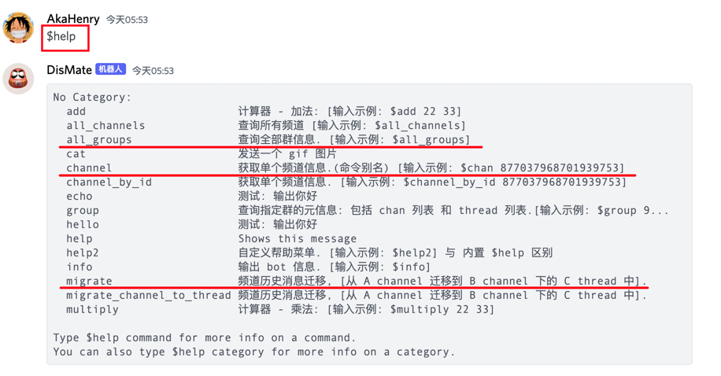

# discord-bot

> 说明:

- ✅ Discord 群消息归档助手.

## Docs:

- ✅ [docs](./docs/readme.md): 详细使用文档

## Features:

> 功能：

- ✅ group 群元信息查询
- ✅ channel 元信息查询
- ✅ thread 元信息查询
- ✅ channel 消息历史迁移(到 thread or 另外一个 channel).

> 帮助菜单:

- ✅ 帮助菜单, 已给出每个指令的传参示例.



## Quick Start:

> requirements:

- python3.10+

> run:

- [Taskfile.yml](Taskfile.yml)

```ruby

# install:
task install

# run:
task run


```
