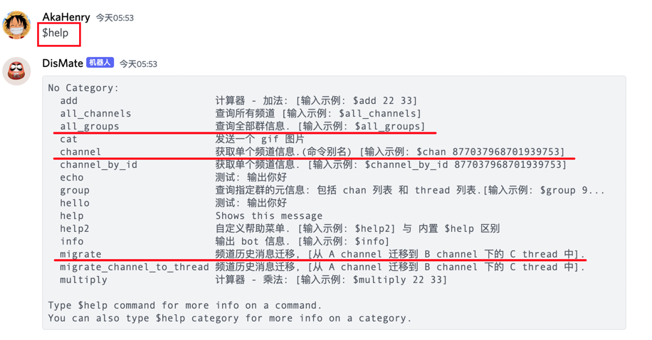
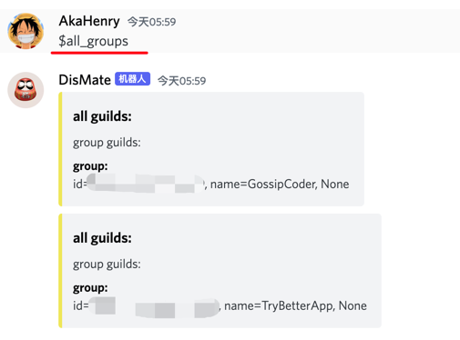
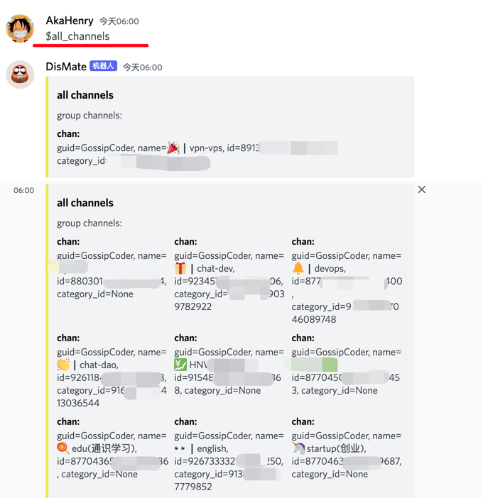
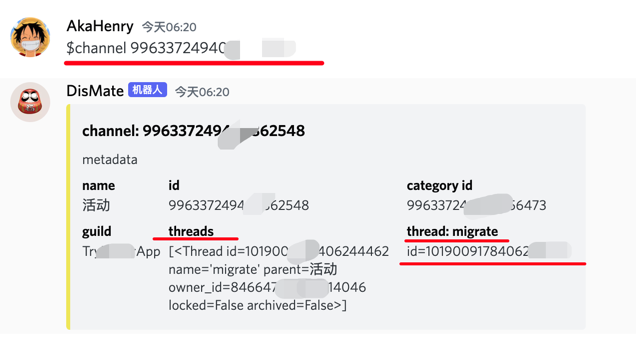
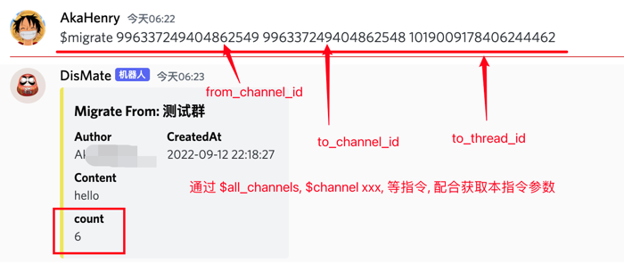
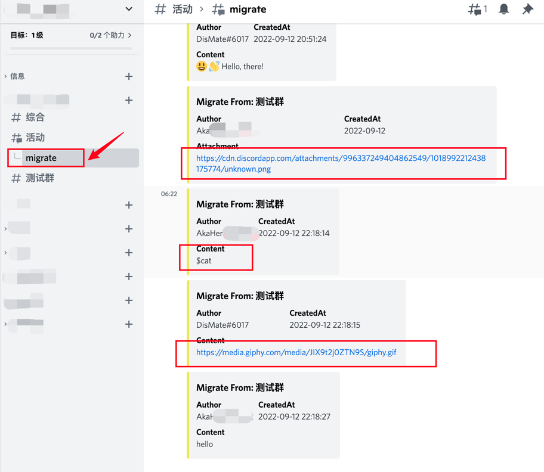

# discord 工具:

> 说明:

- ✅ Discord 群消息归档助手.

## BOT 功能:

- ✅ 已支持非常丰富的功能:
    - ✅ group 群元信息查询
    - ✅ channel 元信息查询
    - ✅ thread 元信息查询
    - ✅ channel 消息历史迁移(到 thread or 另外一个 channel).

### 帮助菜单:

- ✅ 帮助菜单, 已给出每个指令的传参示例.



### 使用截图: 

<details> 
  <summary> 🔋查询 group/channel/thread 元信息: </summary>
  <br> 

> group 群查询:



> channel 查询:



> 指定 channel 查询:




</details> 

<details> 
  <summary> 🔋群 channel 历史消息迁移: </summary>
  <br> 


> channel 消息迁移:

- 原 channel 历史消息:
  


- 执行迁移命令:



- 迁移到 thread 结果:



</details> 


### 文档:

- ✅https://github.com/hhstore/blog/issues/388

## 准备工作:

> 创建 bot:

- https://imyq.co/discord-bot-dev/

> 把本 bot 添加到目标群:

- 此处 bot 要求了最高权限, 只是为了偷懒, 代码里没有脏东西.(后续再逐步改为正常权限)
- bot 邀请链接:
    - https://discord.com/api/oauth2/authorize?client_id=1018558452529909791&permissions=8&scope=bot

## 使用方式:

- 运行:

```ruby
# way1:
cd toolbox/
task discord:run

# way2:
cd packages/discord-cli/
task run

```

## reference:

> libs:

- https://github.com/Rapptz/discord.py
    - https://discordpy.readthedocs.io/en/latest/
    - https://discordpy.readthedocs.io/en/latest/quickstart.html
    - https://discordpy.readthedocs.io/en/latest/ext/commands/api.html
    - https://discordpy.readthedocs.io/en/latest/interactions/api.html

> discord api:

- https://discord.com/developers/docs/intro