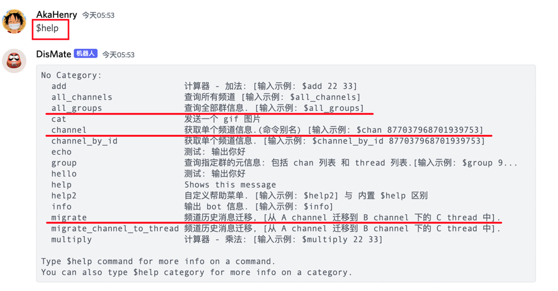

# Toolbox:

- python toolbox

## Packages:

| 子项目                                 | 说明                           | 备注                |
|:------------------------------------|:-----------------------------|:------------------|
| [csv-parser](packages/csv-parser)   | excel表格处理工具                  | ⭐⭐⭐               |
| [discord-bot](packages/discord-bot) | discord bot 工具               | ⭐⭐⭐⭐⭐             |
| [rsshub](packages/rsshub)           | rss 订阅源格式化工具                 | ⭐⭐                |
| [chain](packages/chain)             | eth 脚本工具                     | ⭐⭐                |
| xxxxxxxxxxxxxx                      | xxxxxxxxxxxxxxxxxx           | xxxxxxxxxx        |
| xxxxxxxxxxxxxx                      | xxxxxxxxxxxxxxxxxx           | xxxxxxxxxx        |

> 小工具启动脚本入口:

- ✅ [Taskfile.yml](Taskfile.yml)

> 小工具列表:

- ✅ [chain](packages/chain/run.py): 链上交易数据查询

```ruby

# run:
task chain:run

```

- ✅ [rsshub](packages/rsshub/run.py): rsshub 配置格式化工具

```ruby

# run:
task rss:run

```

- ✅ [discord-bot](packages/discord-cli/readme.md) discord bot, 群消息管理助手, 已支持非常丰富的功能:
    - ✅ group 群元信息查询
    - ✅ channel 元信息查询
    - ✅ thread 元信息查询
    - ✅ channel 消息历史迁移(到 thread or 另外一个 channel).

```ruby

# run:
task discord:run

```

- bot 帮助菜单, 支持的功能列表:



## QuickStart:

> requirements:

- ✅ `Python 3.9.9`: 理论上 python3.5+应该都 ok, 自行判断

```ruby

╰─>$ python --version
Python 3.10.9

```

- ✅ [pyenv](https://github.com/pyenv/pyenv-installer):
    - https://github.com/hhstore/blog/issues/17
- ✅ [go-task](https://github.com/go-task/task)
    - https://github.com/hhstore/blog/issues/300

> setup:

- ✅ pyenv:

```ruby
# with go-task:
task setup

#
# or do:
#

# install python3.9:
pyenv install 3.9.9

# create for this project:
pyenv virtualenv 3.9.9 py39-toolbox

# check:
pyenv versions

# use local:
pyenv local py39-toolbox 

# check:
python3
```

- ✅ install python requirements:

```ruby

task install

```

> init `.env` from [.env.local](.env.local)

- ✅ [Taskfile.yml](Taskfile.yml) will auto load `.env` file

```ruby
# init .env file:
cp .env.local .env

# edit .env file:
.env
```

> then run:

```ruby

# discord bot:
task discord:run

# rsshub tools:
task rss:run

# blockchain tools:
task chain:run

```


## Reference:


- [pipx](https://pypa.github.io/pipx/installation/)
- [poetry](https://python-poetry.org/docs/#installing-with-pipx)
- [cookiecutter](https://cookiecutter.readthedocs.io/en/stable/installation.html)